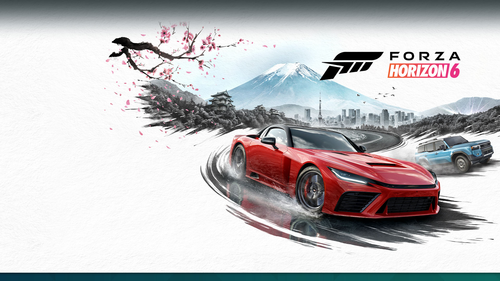
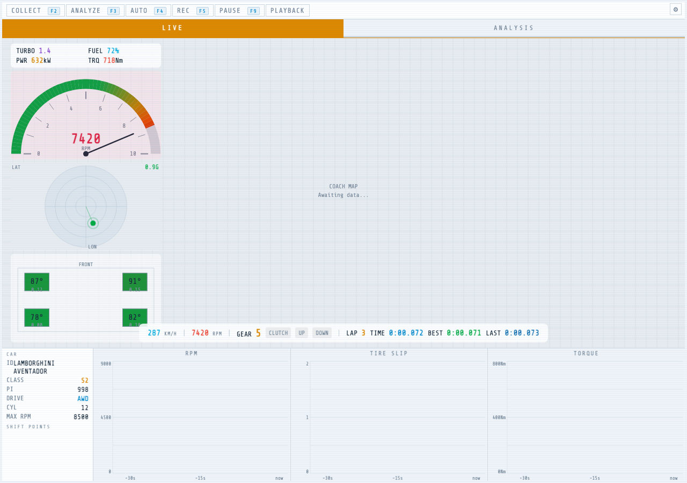
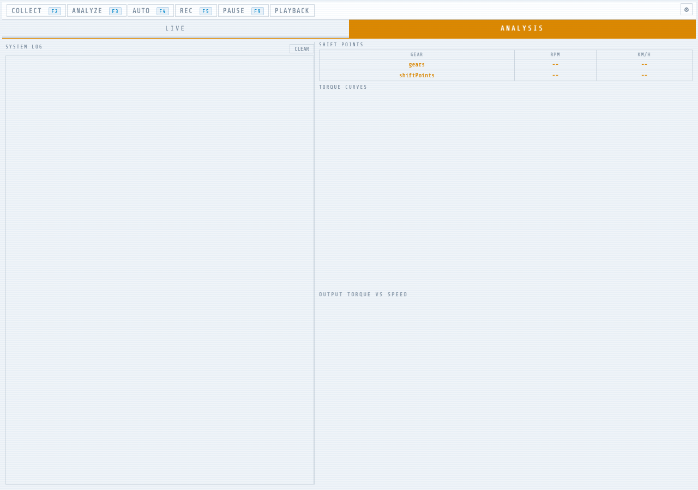
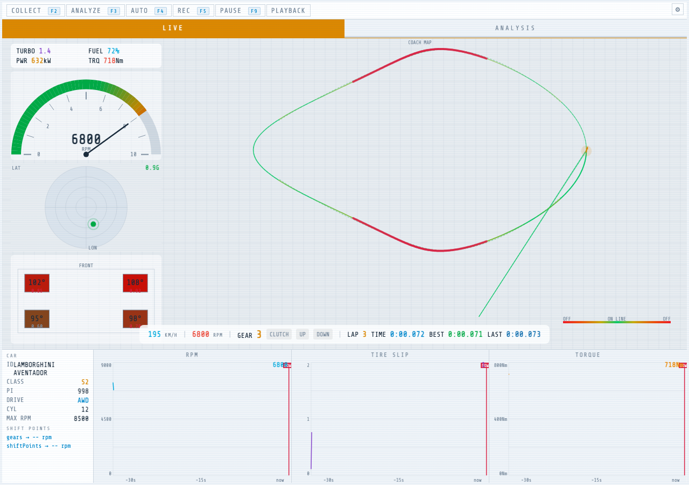
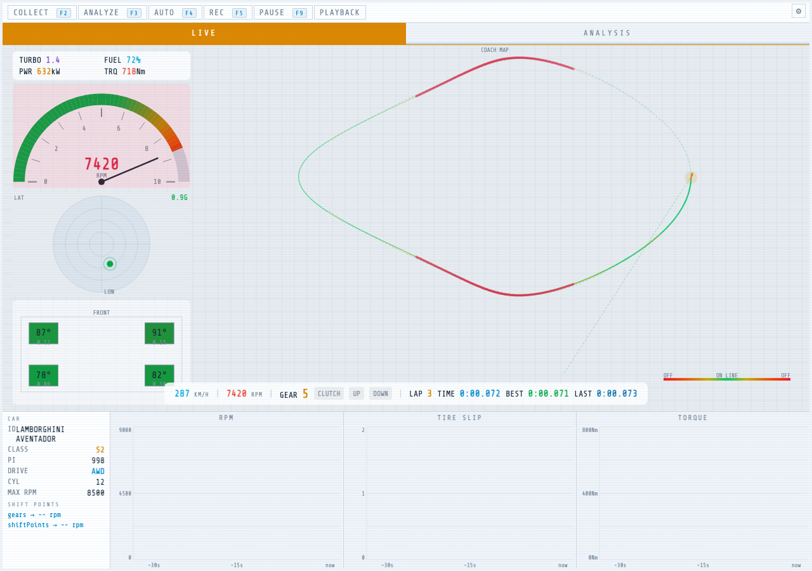

<div align="center">

# 🏎️ Horizon6AutoGear

**English** | [中文](README.zh-CN.md) | [日本語](README.ja.md)

Intelligent driving assistant for Forza Horizon 5/6 and Forza Motorsport.

Receives real-time UDP telemetry at ~60Hz, calculates optimal shift points from torque curves, and provides an AI Driving Coach system.

</div>

---

## 📸 Preview



<table>
  <tr>
    <td align="center"><b>🖥️ Web Dashboard</b></td>
    <td align="center"><b>📊 Torque Analysis</b></td>
  </tr>
  <tr>
    <td></td>
    <td></td>
  </tr>
  <tr>
    <td align="center"><b>🧠 AI Coach HUD</b></td>
    <td align="center"><b>🗺️ Track Map</b></td>
  </tr>
  <tr>
    <td></td>
    <td></td>
  </tr>
</table>

## ✨ Features

- ⚡ **Auto Gear Shifting** — Collects per-gear torque data, analyzes optimal shift RPMs where torque before/after a gear change is equalized, and executes shifts in real time
- 🖥️ **Web GUI Dashboard** — pywebview-based interface with canvas-rendered live torque charts, track map, and telemetry dashboard (Phantom theme)
- 🧠 **AI Driving Coach (MVP)** — Visual coaching overlay with driving line deviation, brake timing, and tire grip indicators
- 🎥 **Session Recording & Playback** — Record UDP telemetry sessions and replay them for offline analysis
- 🔗 **Remote Debug** — Dual-machine setup: agent on game PC forwards telemetry, dev machine runs GUI and analysis
- 🌐 **Bilingual UI** — English and Chinese interface

## 🚀 Quick Start

### Install

```bash
pip install -e .
```

Requires Python >= 3.8. On Windows, `pywin32` is installed automatically for keyboard input.

### Run

```bash
# Launch Web GUI (primary)
horizon6-autogear

# Or via module
python -m horizon6_autogear.gui
```

### 🎮 Game Setup

1. In Forza, open **Settings > HUD** and enable **Data Out**
2. Set **Data Out IP** to your machine's IP (or `127.0.0.1` if same machine)
3. Set **Data Out Port** to `54321` (default, configurable via `FORZA_UDP_PORT` env var)
4. Set **Data Out Packet Format** to `FH6` (or `FH5` for Forza Horizon 5)
5. Launch Horizon6AutoGear and click **Collect** to begin recording torque data

## 🔄 Usage Workflow

1. 📡 **Collect** — Drive the car through all gears. The system records RPM, speed, torque, and tire slip per gear
2. 📈 **Analyze** — Computes optimal shift points from collected torque curves
3. 🏁 **Run** — Engages real-time auto shifting at telemetry refresh rate

Shift configs are auto-saved per car (by ordinal + performance + drivetrain) and auto-loaded when you switch cars.

## 🏗️ Architecture

```
Forza Game (UDP) ➜ ForzaDataPacket (parser) ➜ Forza (engine)
                        |                          |
                        v                          v
               Coach HUD overlay           gear_helper (shift logic)
                                               |
                                               v
                                        keyboard (Win32 / macOS input)
```

### Package Structure

```
src/horizon6_autogear/
├── core/           # Forza engine, CarInfo model, data packet parser, recorder/playback
├── shifting/       # Shift algorithm (gear_helper.py), keyboard input (Win32 + macOS)
├── config/         # Constants: UDP settings, key bindings, timing, UI colors, i18n
├── gui/            # Chart widgets, HUD overlay
├── gui.py          # pywebview Web GUI (primary UI)
└── utils/          # Socket helpers, config I/O, plotting, logging
```

### Shift Algorithm

The optimal shift point is the RPM where torque in the current gear equals torque in the next gear. See [`docs/SHIFT_ALGORITHM.md`](docs/SHIFT_ALGORITHM.md) for the mathematical derivation.

## 🛠️ Development

### Testing

```bash
pytest                       # Run all tests
pytest tests/test_forza.py   # Single file
pytest --cov                 # With coverage
```

### Linting

```bash
ruff check .
```

### Dev Dependencies

```bash
pip install -e ".[dev]"   # pytest, ruff, pytest-cov
pip install -e ".[all]"   # dev + pyinstaller
```

### 📦 Packaging (Windows)

```bash
pip install pyinstaller
# Use the included spec file
pyinstaller package/gui.spec
```

## ⚙️ Environment Variables

| Variable | Default | Description |
|----------|---------|-------------|
| `FORZA_UDP_IP` | `0.0.0.0` | IP to listen for telemetry |
| `FORZA_UDP_PORT` | `54321` | UDP port for telemetry data |

## 🗺️ AI Driving Coach Roadmap

- ✅ **Phase 1: Coach HUD (MVP)** — Visual overlay with driving line, brake timing, tire grip. *Current*
- 🔜 **Phase 2: Reference Profile** — Record AI laps, speed delta / gear suggestions / brake point preview
- 🔜 **Phase 3: Semi-Auto** — ViGEmBus virtual controller, auto-brake + auto-shift
- 🔜 **Phase 4: Full-Auto** — Autonomous driving (steer + throttle + brake + gear) with PID control

## 📚 Documentation

- [Shift Algorithm](docs/SHIFT_ALGORITHM.md) — Mathematical derivation of optimal shift points
- [UDP Data Spec](docs/FORZA_UDP_DATA_SPEC.md) — Forza telemetry packet format reference
- [Web GUI Design](docs/web-gui-design.md) — Frontend architecture and theme system

## 📄 License

[MIT](LICENSE) &copy; 2025-2026 Burlesque1
