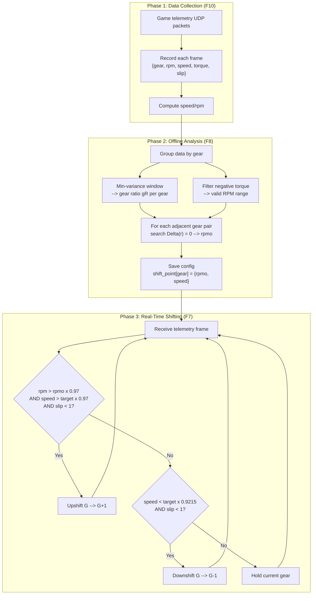

# 换挡算法原理 (Shift Algorithm)

Horizon6AutoGear 的自动换挡核心基于 **输出力矩最大化** 原理：在每对相邻挡位之间找到一个最优转速，使得换挡前后车轮输出的驱动力矩连续且不下降。

算法理论参考：[Optimal Shift Point -- Glenn Messersmith](https://glennmessersmith.com/shiftpt.html)

---

## 目录

- <a href="#glossary">关键名词</a>
- <a href="#gear-ratio">一、传动比推导</a>
- <a href="#shift-point">二、最优换挡点方程</a>
- <a href="#realtime">三、实时换挡决策</a>
- <a href="#aux">四、辅助处理</a>
- <a href="#flow">五、完整流程</a>
- <a href="#comparison">六、算法对比</a>
- <a href="#validation">七、实验验证</a>
- <a href="#references">相关文件</a>

---

<a id="glossary"></a>
## 关键名词

| 术语 | 英文 | 含义 |
|------|------|------|
| **传动比** | Gear Ratio (gR) | 每挡的速度/转速常数，反映齿轮减速比 |
| **最优换挡转速** | Optimal Shift RPM (rpmo) | 升挡前后输出力矩相等时的发动机转速 |
| **输出力矩** | Output Torque | 发动机扭矩经传动系统放大后作用在车轮上的力矩 |
| **滑移率** | Tire Slip Ratio | 轮胎线速度与车辆速度的比值，>= 1 表示打滑 |
| **滑移角** | Tire Slip Angle | 轮胎实际行进方向与轮胎指向的夹角 |
| **换挡因子** | Shift Factor | 应用于换挡点的安全系数 (默认 0.97)，防止在边界频繁换挡 |
| **滞后区间** | Hysteresis Band | 升挡和降挡触发条件之间的速度差，避免挡位抖动 |
| **最小方差窗口** | Min-Variance Window | 滑动窗口中 speed/rpm 方差最小的区间，用于计算稳定传动比 |
| **遥测数据** | Telemetry Data | 游戏通过 UDP 协议实时输出的车辆状态数据包 (ForzaDataPacket) |

---

<a id="gear-ratio"></a>
## 一、传动比推导 (Gear Ratio)

### 物理关系

车辆行驶速度与发动机转速的基本关系：

```
speed = rpm x 60 x (pi x tire_diameter) / gear_ratio / final_drive
```

其中轮胎直径、最终传动比、pi 为常量，合并为一个常数 C：

```
speed = rpm x C / (gear_ratio x final_drive)
```

令 `gR = C / (gear_ratio x final_drive)`，简化为：

```
speed = rpm x gR    -->    gR = speed / rpm
```

> **关键结论**：不必知道轮胎直径或最终传动比等车辆参数，通过遥测数据的 `speed / rpm` 即可反推每挡的综合传动比。

### 最小方差窗口法 (Min-Variance Window)

直接使用 `speed / rpm` 会有噪声（换挡瞬间、轮胎打滑等），因此采用滑动窗口最小方差法提取稳定值：

```
窗口大小 = 20 个采样点 (GEAR_RATIO_WINDOW_SIZE)
滑动步长 = 5 个采样点 (GEAR_RATIO_WINDOW_STEP)
```

对每个窗口计算 `speed/rpm` 的方差，取方差最小（数据最稳定）的窗口的均值作为该挡的传动比 `gR`。

```
speed/rpm 采样序列 (某一挡位):
 -----------------------------------------------------> 时间

 Normal   | Shift   |  Normal   | Slip    | Normal
 stable --|-- wobble|-- stable --|-- wobble|-- stable
          |         |           |         |
        Win A     Win B       Win C     Win D
       var=0.001  var=0.050  var=0.002  var=0.080
                   ^                     ^
                 shift                  slip

 Select: Win A (lowest variance) --> gR = mean(speed/rpm in Win A)
```

代码位置：`gear_helper.py` --> `get_gear_ratio_map()`

### 线性回归法 (Linear Regression)

物理关系 `speed = gR x rpm` 本质上是一条**过原点的直线**，斜率就是传动比 gR。

对 `speed ~ rpm` 做过原点最小二乘线性回归：

```
  speed (km/h)
   ^                .  .
   |              .    .  .
   |            .    .       <-- scatter points (with noise)
   |          .  .    .
   |        .    .  .
   |      .    .
   |    .  .
   |  .    .
   | .  .
   |/ <-- fitted line: speed = gR x rpm, slope gR is the gear ratio
   +------------------------------> RPM
```

给定 N 个采样点 `(rpm_i, speed_i)`，过原点直线 `speed = gR x rpm` 的最小二乘解：

```
         N
        SUM  speed_i x rpm_i
        i=1
gR = -------------------------
         N
        SUM  rpm_i^2
        i=1
```

拟合质量用 R-squared 评估：

```
         SUM( speed_i - gR x rpm_i )^2
R^2 = 1 - -------------------------------
         SUM( speed_i - speed_mean )^2
```

R-squared 越接近 1，说明数据越符合线性关系（即传动比越稳定）。

回归前先过滤打滑数据，只用抓地状态的数据点（slip < 1）。

代码实现约 10 行（numpy 向量运算），无需额外依赖。

---

<a id="shift-point"></a>
## 二、最优换挡点方程 (Optimal Shift Point)

### 核心思想

**在换挡前后驱动力矩相等的那个转速换挡，能实现最大加速度。**

设在转速 r 时从 G 挡换到 G+1 挡：

- **换挡前**（G 挡，转速 r）的输出力矩：

  ```
  T_before = Torque(r) / gR(G)
  ```

- **换挡后**（G+1 挡），转速因传动比变化而跳变：

  ```
  r' = r x gR(G) / gR(G+1)    <-- 换挡后发动机转速（下降，因为 gR(G) < gR(G+1)）
  T_after = Torque(r') / gR(G+1)
  ```

- **差值函数**：

  ```
  Delta(r) = Torque(r) / gR(G)  -  Torque(r x gR(G)/gR(G+1)) / gR(G+1)
  ```

### 最优条件

```
Delta(r) --> 0    即 T_before = T_after
```

直觉解释：

- `Delta > 0`：当前挡力矩更大 --> 不应换挡
- `Delta < 0`：高挡力矩更大 --> 应更早换挡
- `Delta = 0`：力矩相等 --> **最优换挡点**

### 力矩曲线图解

```
  Output Torque
    ^
    |        Gear G (lower)
    |       /\
    |      /  \
    |     /    \         Gear G+1 (higher)
    |    /      \       /\
    |   /        \     /  \
    |  /          \   /    \
    | /            \ /      \
    |/              *---------\--->  Optimal shift point rpmo
    |              /|\        \
    |             / | \        \
    |            /  |  \        \
    |           /   |   \        \
    +-----------+---+----+---------+--> RPM
               r1  rpmo  r2

  * : Torque(r)/gR(G) = Torque(r')/gR(G+1)
      i.e. intersection of two output torque curves

  Left of rpmo : Delta > 0, lower gear torque is higher --> stay in lower gear
  Right of rpmo: Delta < 0, higher gear torque is higher --> should have shifted
```

换挡后转速从 r 跳变到 r'（因高挡 gR 更大，RPM 下降）：

```
  RPM
   ^
   |  Before shift r --> r' After shift
   |            \
   |             \  (RPM drops because gR(G) < gR(G+1))
   |              \
   |               --> r' = r x gR(G) / gR(G+1)
   |
   +------------------------------> Time
      ^               ^
    Gear G          Gear G+1
```

### 搜索策略

从高转速向低转速搜索（步长 50 RPM），找到满足以下条件的最优转速 `rpmo`：

1. `|Delta|` 最小（力矩差最小，即最接近零交叉点）
2. `T_before >= T_before(rpmo)`（力矩不下降，避免选到低力矩的等效点）

```
搜索范围：min_rpm ~ max_rpm（当前挡和下一挡的有效 RPM 区间的交集）
搜索方向：从高到低（优先选择高转速换挡点）
步长：50 RPM (SHIFT_POINT_RPM_STEP)
```

代码位置：`gear_helper.py` --> `calculate_optimal_shift_point()`

### RPM 有效区间

并非所有 RPM 范围的数据都有效。算法会过滤掉扭矩为负的区间（发动机制动区），只保留最大连续正扭矩区间用于计算。

代码位置：`gear_helper.py` --> `get_rpm_torque_map()`

---

<a id="realtime"></a>
## 三、实时换挡决策 (Real-Time Shifting)

预计算得到每挡的 `shift_point[gear] = {rpmo, speed}` 后，实时决策基于以下条件。

### 升挡条件（三条件同时满足）

```
rpm   > rpmo x shift_factor          # 转速超过换挡点
slip  < 1.0                          # 后轮不打滑
speed > target_speed x shift_factor  # 速度也达到换挡点
```

其中 `shift_factor = 0.97` (SHIFT_FACTOR)，提供 3% 的缓冲区。

### 降挡条件

```
speed < target_down_speed x shift_factor x 0.95    # 即 target x 0.9215
slip  < 1.0                                         # 不打滑
```

其中 `target_down_speed` 取低一挡的换挡点速度，乘以 `shift_factor (0.97)` 后再乘以 `DOWNSHIFT_SPEED_FACTOR (0.95)`。实际阈值为 `shift_point x 0.97 x 0.95 = shift_point x 0.9215`。

### 滞后区间（防抖动）

```
升挡触发：speed > target x 0.97
降挡触发：speed < target x 0.9215

滞后区间 = target x (0.97 - 0.9215) = target x 0.0485
```

这个约 4.85% 的速度区间防止在换挡点附近频繁升降挡（挡位抖动）。

```
  Speed --->
  ---------------------------------------------------->
       |                |                |
       |   Downshift    |   Hysteresis   |   Upshift
       |   (G+1 -> G)   |    (hold)      |  (G -> G+1)
       |                |                |
       +----------------+----------------+
     0      target*0.9215    target*0.97      target
              ^                ^
              |   ~4.85% zone  |
              |  no shifting   |
```

### RWD 特殊处理

后驱车在低挡（1-2 挡）容易打滑，代码中预留了 RWD 专用逻辑分支：
- 降挡时不会降到 1 挡（防止后轮突然获得过大扭矩而失控）
- 阈值：`RWD_LOW_GEAR_THRESHOLD = 3`

代码位置：`forza.py` --> `shifting()`

---

<a id="aux"></a>
## 四、辅助处理

### 轮胎打滑检测

```python
slip = (tire_slip_ratio_RL + tire_slip_ratio_RR) / 2  # 后轮平均滑移率
```

- `slip < 1`：轮胎抓地，正常换挡
- `slip >= 1`：轮胎打滑，禁止换挡

打滑时车辆处于不稳定状态，换挡点计算的前提（轮胎完全传递驱动力）不再成立，需等恢复抓地力后再决策。

### 离合操作时序

开启离合模式时，换挡遵循以下时序：

```
提交离合按下（异步线程池）--> 等待 0ms --> 按换挡键 --> 等待 60ms --> 松离合
```

离合按下通过线程池异步提交（`threadPool.submit`），`DELAY_CLUTCH_TO_SHIFT = 0` 意味着不额外等待，依赖线程调度保证离合先于换挡生效。

降挡时额外执行补油 (blip throttle)：短按油门 120ms (`BLIP_THROTTLE_DURATION`)，使发动机转速匹配高齿轮比。

---

<a id="flow"></a>
## 五、完整流程



---

<a id="comparison"></a>
## 六、算法对比

| 维度 | 最小方差窗口 (MinVar) | 线性回归 (LinReg) | RANSAC 回归 |
|------|:--------------------:|:-----------------:|:-----------:|
| **数据利用率** | 低（单窗口 20 点） | 高（全部稳定数据） | 高（自动选内点） |
| **抗噪声** | 一般（均值敏感） | 好（最小二乘平滑） | 最佳（自动剔除离群点） |
| **滑移过滤** | 无（盲选窗口） | 预过滤 slip < 1 | 自动识别 |
| **拟合质量评估** | 仅方差 | R-squared 值（工业标准） | 内点比例 |
| **参数依赖** | 窗口大小 20, 步长 5 | 无 | 无 |
| **物理意义** | 间接统计 | 直接对应 speed = gR x rpm | 同线性回归 |
| **实现复杂度** | 低 | 低（约 10 行） | 中（需 sklearn） |
| **新增依赖** | 无 | 无（numpy 已有） | scikit-learn |
| **改动范围** | -- | 仅 `get_gear_ratio_map()` | 仅 `get_gear_ratio_map()` |
| **向后兼容** | -- | 输出格式不变 | 输出格式不变 |

**推荐路径**：先用线性回归替换最小方差窗口（改动最小、收益最大）。如果实测发现某些车辆数据噪声仍较大，再升级为 RANSAC。

---

<a id="validation"></a>
## 七、实验验证

使用合成数据验证算法正确性。合成车辆参数：6 挡，峰值扭矩位于 4500 RPM（中转速峰值扭矩车型），扭矩曲线呈钟形分布。

> 验证目标：确认修正后的搜索算法能在非退化情况下（Delta 穿越零点）正确找到换挡点，而非简单退化为红线换挡。

### 传动比精度

| 挡位 | 真实 gR | MinVar 估计 | MinVar 误差 | LinReg 估计 | LinReg 误差 |
|:----:|--------:|:-----------:|:-----------:|:-----------:|:-----------:|
| 1 | 0.0100 | 0.01006 | 0.61% | 0.01022 | 2.22% |
| 2 | 0.0160 | 0.01602 | 0.12% | 0.01607 | 0.42% |
| 3 | 0.0230 | 0.02302 | 0.08% | 0.02296 | 0.18% |
| 4 | 0.0310 | 0.03102 | 0.07% | 0.03105 | 0.18% |
| 5 | 0.0400 | 0.04002 | 0.05% | 0.03993 | 0.18% |
| 6 | 0.0500 | 0.05004 | 0.08% | 0.04991 | 0.18% |

- MinVar 误差范围：0.05% -- 0.61%，低挡位（1-2 挡）略高
- LinReg 误差范围：0.18% -- 2.22%，1 挡误差最大
- MinVar 在低挡位（1-2 挡）精度稍好，LinReg 在高挡位（3-5 挡）略优

### 换挡点结果

| 挡位切换 | MinVar RPM | LinReg RPM | RPM 差异 |
|:--------:|:----------:|:----------:|:--------:|
| 1 --> 2 | 5750 | 5800 | 50 |
| 2 --> 3 | 5750 | 5800 | 50 |
| 3 --> 4 | 5800 | 5800 | 0 |
| 4 --> 5 | 5800 | 5800 | 0 |
| 5 --> 6 | 5800 | 5800 | 0 |

换挡 RPM 集中在 5750 -- 5800 RPM，与该车的峰值扭矩转速（4500 RPM）和扭矩曲线形态一致。MinVar 与 LinReg 的换挡 RPM 差异最多为 50 RPM（一个搜索步长）。

### 结论

1. **两种方法等价**：传动比误差均低于 2.5%，换挡 RPM 差异不超过一个搜索步长（50 RPM），在实用层面完全等价
2. **低挡位注意**：1 挡因轮胎打滑最频繁，两种方法的误差都相对偏高，但换挡点计算仍可靠
3. **搜索算法有效**：修正后的搜索算法在 Delta 穿越零点的情况下能正确定位换挡点，不退化为红线换挡
4. **推荐选择**：MinVar 实现更简单、无额外依赖且低挡精度更好，是当前默认方法的合理选择

---

<a id="references"></a>
## 相关文件

> 以下路径相对于 `src/horizon6_autogear/`

| 文件 | 作用 |
|------|------|
| `shifting/gear_helper.py` | 传动比计算、最优换挡点搜索、换挡执行 |
| `core/forza.py` | 数据采集、实时换挡决策、挡位状态管理 |
| `utils/helper.py` | 可视化绘图、配置序列化 |
| `config/config.py` | 算法参数常量（窗口大小、步长、安全系数等） |
